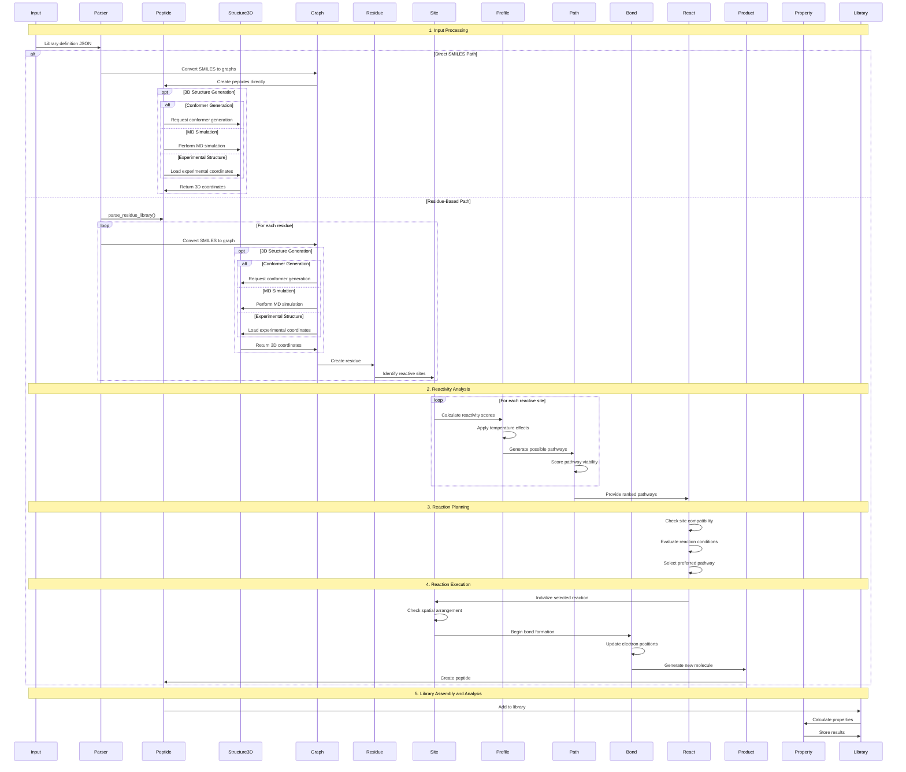

# PepLab

## Current Workflows

```mermaid
sequenceDiagram
    participant Input
    participant Parser
    participant Peptide
    participant Structure3D
    participant Graph
    participant Residue
    participant Site
    participant Profile
    participant Path
    participant Bond
    participant React
    participant Product
    participant Property
    participant Library

    Note over Input,Library: 1. Input Processing
    Input->>Parser: Library definition JSON
    
    alt Direct SMILES Path
        Parser->>Graph: Convert SMILES to graphs
        Graph->>Peptide: Create peptides directly
        
        opt 3D Structure Generation
            alt Conformer Generation
                Peptide->>Structure3D: Request conformer generation
            else MD Simulation
                Peptide->>Structure3D: Perform MD simulation
            else Experimental Structure
                Peptide->>Structure3D: Load experimental coordinates
            end
            Structure3D->>Peptide: Return 3D coordinates
        end

    else Residue-Based Path
        Parser->>Peptide: parse_residue_library()
        loop For each residue
            Parser->>Graph: Convert SMILES to graph
            
            opt 3D Structure Generation
                alt Conformer Generation
                    Graph->>Structure3D: Request conformer generation
                else MD Simulation
                    Graph->>Structure3D: Perform MD simulation
                else Experimental Structure
                    Graph->>Structure3D: Load experimental coordinates
                end
                Structure3D->>Graph: Return 3D coordinates
            end
            
            Graph->>Residue: Create residue
            Residue->>Site: Identify reactive sites
        end
        
        Note over Input,Library: 2. Reactivity Analysis
        loop For each reactive site
            Site->>Profile: Calculate reactivity scores
            Profile->>Profile: Apply temperature effects
            Profile->>Path: Generate possible pathways
            Path->>Path: Score pathway viability
        end
        Path->>React: Provide ranked pathways
        
        Note over Input,Library: 3. Reaction Planning
        React->>React: Check site compatibility
        React->>React: Evaluate reaction conditions
        React->>React: Select preferred pathway
        
        Note over Input,Library: 4. Reaction Execution
        React->>Site: Initialize selected reaction
        Site->>Site: Check spatial arrangement
        Site->>Bond: Begin bond formation
        Bond->>Bond: Update electron positions
        Bond->>Product: Generate new molecule
        Product->>Peptide: Create peptide
    end
    
    Note over Input,Library: 5. Library Assembly and Analysis
    Peptide->>Library: Add to library
    Library->>Property: Calculate properties
    Property->>Library: Store results
```
